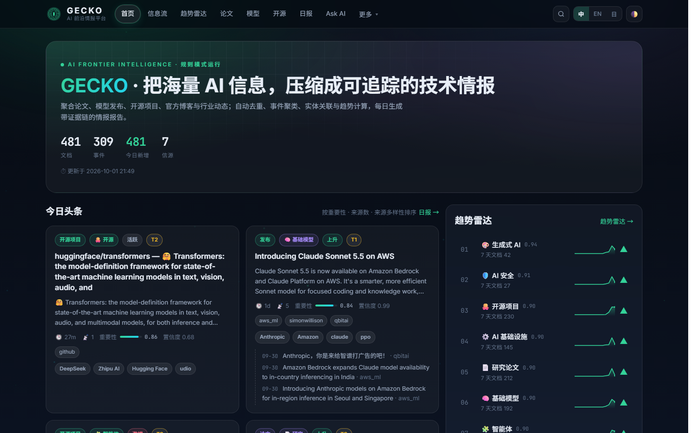
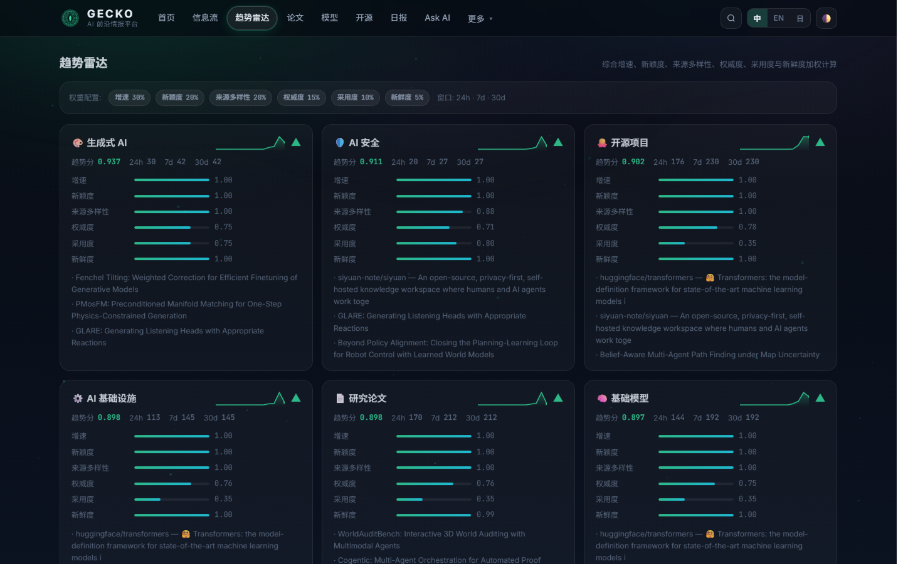
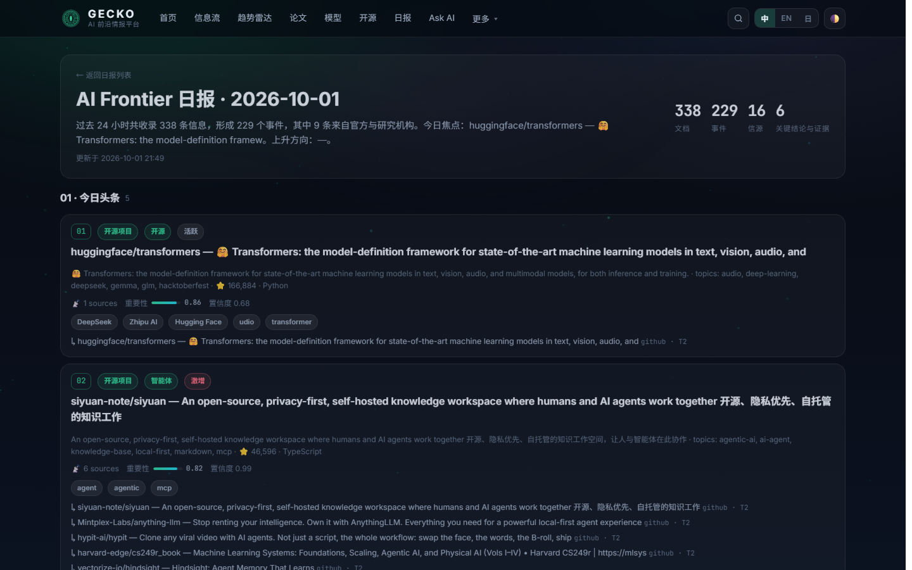
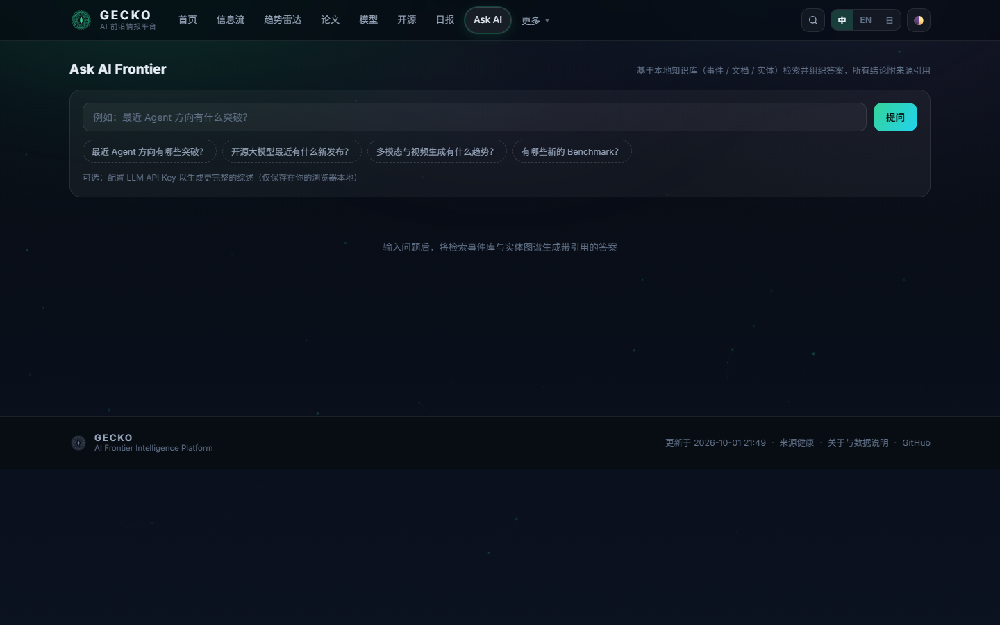
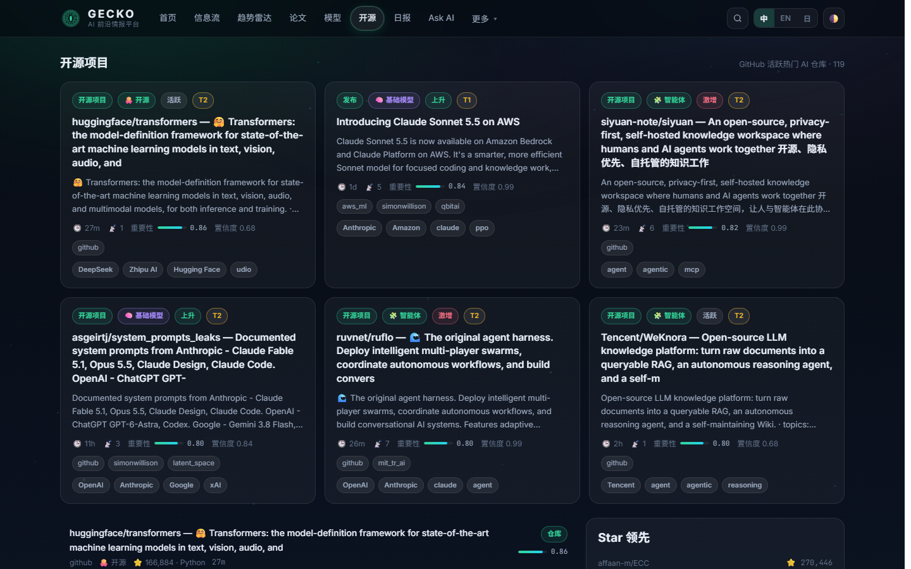

<div align="center">

[中文](README.md) · **English** · [日本語](README.ja.md)


# GECKO · AI Frontier Intelligence Platform

**Turn the AI firehose into trackable, verifiable technical intelligence**

Papers · model releases · open-source projects · official blogs · industry news — automatically
deduplicated, clustered into events, linked into entities, and scored into daily intelligence
reports (Chinese / English / Japanese) with evidence chains.

[](https://HuanMoovo.github.io/gecko/)
[](https://github.com/HuanMoovo/gecko/actions)
[](scripts/gecko)
[](js)

🌐 **Live site**: <https://HuanMoovo.github.io/gecko/> · 中文 / English / 日本語

</div>

---

## 📸 Screenshots

| Home · Dashboard | Trend Radar |
|---|---|
|  |  |

| Daily Intelligence Report (trilingual) | Ask AI Frontier |
|---|---|
|  |  |

| Open Source Center |
|---|
|  |

---

## ✨ Core Capabilities

### 1. Event-centric, not an article firehose

A traditional aggregator treats "100 articles = 100 news items". GECKO does this:

```text
100 articles ──► dedup ──► event clustering ──► 1 technical event card
                                                ├─ official blog
                                                ├─ paper / arXiv
                                                ├─ GitHub repo
                                                ├─ media 1
                                                └─ community discussion
```

Users see **events** with a full evidence timeline, not duplicate news.

### 2. Three-level deduplication

| Level | Method | Catches |
|---|---|---|
| L1 Exact | canonical URL / content hash / title hash | same URL, UTM parameter changes, full reposts |
| L2 Near-duplicate | title similarity (token Jaccard + character n-grams) | near-identical reposts |
| L3 Semantic | entity overlap + joint title scoring → merge into one event | "A releases X" vs "X released by A" |

### 3. Multi-label classification

Rule + lexicon, four-stage (Title → Metadata → Keyword → optional LLM), covering 10 top-level
areas and 40+ subcategories:

`Foundation Models` `Agents` `Generative AI` `Robotics` `AI Infrastructure` `Research` `Open Source` `AI Safety` `AI for Science` `Industry`

### 4. Knowledge Graph

Automatically extracts **organizations / models / concepts / benchmarks / products** and builds relations:

```text
OpenAI ──develops──► GPT-5.5 ──implements──► chain-of-thought
       ──works_on──► reasoning    ──evaluated_on──► GPQA
```

### 5. Trend Engine (TrendScore)

Not just counting articles — a weighted six-dimension score:

```text
TrendScore = 30% Velocity      + 20% Novelty
           + 20% Source Diversity + 15% Authority
           + 10% Adoption      +  5% Recency
```

Weights are configurable in [`scripts/gecko/config.py`](scripts/gecko/config.py); observation
windows: 24h / 7d / 30d.

### 6. Claim → Evidence chain

Key conclusions in daily reports are bound to source evidence with a corroboration status:

```text
Claim:        OpenAI releases GPT-5.5 with 3x better reasoning
Evidence:     [official blog] [TechCrunch] [Hacker News]
Confidence:   0.94     Status: corroborated (multi-source)
```

Single-source claims are explicitly marked `single_source` — evidence strength is never overstated.

### 7. Trilingual daily report

Generated automatically every day:

- **Trilingual intro** (zh / en / ja; written by AI when an LLM key is configured, template-based otherwise)
- Headlines (3–6, with evidence chains)
- Sections: Research / Models / Agents / Multimodal / Robotics / Open Source / Infrastructure / Safety / Industry
- New models / new papers / open-source projects / datasets
- Trend changes (rising ▲ / cooling ▼ / new ✦)
- Watchlist (events followed across multiple sources)
- Claims & verification status

### 8. Ask AI Frontier & Deep Research

Retrieval-based Q&A over the local knowledge base (events + documents + entities + timelines);
every answer **carries citations**. With an LLM API key configured, it produces full syntheses.
Deep Research mode compiles cross-source evidence briefs.

---

## 🏗 Architecture

```text
┌───────────────────── GitHub Actions (every 4 hours) ──────────────────┐
│                                                                       │
│  ┌───────────────────────────────────────────────────────────────┐   │
│  │  Python pipeline  scripts/gecko/                              │   │
│  │                                                               │   │
│  │  connectors ─► normalize ─► dedup ─► classify ─► cluster      │   │
│  │  (pluggable)   (canonical) (3-level) (multi-label) (events)   │   │
│  │       │                                          │            │   │
│  │       │                                          ▼            │   │
│  │       │                                    trend engine       │   │
│  │       │                                    (6-dim weighted)   │   │
│  │       ▼                                          │            │   │
│  │   [optional LLM layer] ◄──────────────────► report agent      │   │
│  │   (summaries / trilingual intro / titles)  (Claim/Evidence)   │   │
│  └───────────────────────────────────────────────────────────────┘   │
│                              │                                        │
│                              ▼                                        │
│              data/*.json  (static JSON API layer)                     │
└───────────────────────────────────────────────────────────────────────┘
                               │
                     GitHub Pages (free hosting · global CDN)
                               │
┌──────────────────────────────▼────────────────────────────────────────┐
│  Frontend SPA (plain HTML / CSS / Vanilla JS — no build step)         │
│  Home · Feed · Trends · Research · Models · Projects · Organizations  │
│  Benchmarks · Reports · Ask AI · Deep Research · Sources · About      │
└───────────────────────────────────────────────────────────────────────┘
```

**Design stance**: deterministic pipeline first, LLM as an optional enhancement layer;
zero servers, zero ops, zero cost.

---

## 📡 Data Sources

Connectors are pluggable ([`scripts/gecko/connectors/`](scripts/gecko/connectors)) — adding a
source means adding one adapter:

| Category | Sources | Tier |
|---|---|---|
| 📄 Academic | **arXiv** (cs.AI / cs.CL / cs.LG / cs.CV / cs.RO / cs.NE) | 2 |
| 🐙 Open source | **GitHub** (12 topic searches: llm / agent / multimodal / robotics / rag …) | 2 |
| 🤗 Models | **Hugging Face** (trending models + datasets) | 2 |
| 📰 Official blogs | OpenAI · Google DeepMind · Meta AI · Microsoft Research · NVIDIA · Hugging Face · AWS · Mistral · Stability (RSS) | 1 |
| 📱 Media | TechCrunch · VentureBeat · The Verge · Ars Technica · MIT Tech Review · 机器之心 · 量子位 · 36Kr | 3 |
| 💬 Community | Hacker News · Simon Willison · Import AI · Latent Space · Interconnects · r/MachineLearning | 4 |

**Source tier** feeds directly into importance scoring: Tier 1 = official / research labs, descending.

---

## 🚀 Quick Start

### Run locally

```bash
git clone https://github.com/HuanMoovo/gecko.git
cd gecko

# 1) Run the data pipeline (fetch → process → generate reports)
python scripts/gecko/run.py

# 2) Start a local preview (the SPA needs an HTTP server; opening index.html directly won't load data)
python -m http.server 8000
# → http://127.0.0.1:8000
```

### Common commands

```bash
python scripts/gecko/run.py                # regular incremental run (fetch + update)
python scripts/gecko/run.py --report-only  # rebuild trends & report only (no fetch)
python scripts/gecko/run.py --days 90      # use a 90-day trend window
python scripts/test_pipeline.py            # offline smoke test (mock data, no network)
python scripts/make_logo.py                # regenerate brand assets (SVG)
```

### Dependencies

**Zero third-party dependencies** — the pipeline uses only the Python 3.11+ standard library
(`urllib` / `json` / `xml`); the frontend has no build step. `git clone` and run.

---

## ⚙️ Configuration

### Optional: AI enhancement (LLM)

Everything works without it (rule mode). With a key configured you get:

- Document briefs (`ai_brief`)
- Trilingual daily-report intro (written by AI)
- Trilingual headline titles (zh / en / ja)

```bash
export GECKO_LLM_API_KEY=sk-...                        # DeepSeek / OpenAI-compatible
export GECKO_LLM_BASE_URL=https://api.deepseek.com/v1  # optional
export GECKO_LLM_MODEL=deepseek-chat                   # optional
```

On GitHub: `Settings → Secrets and variables → Actions → New repository secret`
(`GECKO_LLM_API_KEY` required; `GECKO_LLM_BASE_URL` / `GECKO_LLM_MODEL` optional).

### Other environment variables

| Variable | Purpose |
|---|---|
| `GECKO_GITHUB_TOKEN` | Raises GitHub Search API rate limits (auto-injected in Actions) |
| `GECKO_PROXY` | HTTP proxy for local development (the pipeline also auto-detects common local proxy ports) |

### Customization

| What to change | Where |
|---|---|
| Sources / RSS feeds | `scripts/gecko/config.py` → `RSS_FEEDS` |
| Category tree & keywords | `scripts/gecko/config.py` → `CATEGORY_TREE` / `CATEGORY_KEYWORDS` |
| Organization registry (with authority tier) | `scripts/gecko/config.py` → `ORGANIZATIONS` |
| Entity lexicon (models / concepts / benchmarks) | `scripts/gecko/config.py` → `ENTITY_LEXICON` |
| Trend weights | `scripts/gecko/config.py` → `TREND_WEIGHTS` |
| Update frequency | `.github/workflows/gecko-pipeline.yml` → `cron` |

---

## 📂 Project Structure

```text
gecko/
├── index.html                      # SPA shell
├── css/style.css                   # design system (glassmorphism · glow · dark/light)
├── js/
│   ├── app.js                      # routing / theme / particles / global search
│   ├── api.js                      # static data layer (fetch + cache)
│   ├── components.js               # card / badge / sparkline components
│   ├── i18n.js                     # zh / en / ja dictionaries
│   └── views-*.js                  # page views (home / feed / trends / lib / report / ask)
│
├── scripts/
│   ├── gecko/                      # ── Python data pipeline ──
│   │   ├── config.py               #   source registry / category tree / lexicon / weights
│   │   ├── core.py                 #   Canonical Document · classification · entity extraction · scoring
│   │   ├── pipeline.py             #   dedup · event clustering · trend engine · knowledge graph
│   │   ├── report.py               #   daily report (trilingual intro · Claim/Evidence)
│   │   ├── llm.py                  #   optional LLM enhancement layer
│   │   ├── net.py                  #   HTTP (retries / proxy auto-fallback)
│   │   ├── store.py                #   storage (date shards / index)
│   │   ├── run.py                  #   entry point
│   │   └── connectors/             #   Source Adapter plugins
│   │       └── arxiv.py · github.py · huggingface.py · hackernews.py · rss.py
│   ├── make_logo.py                # brand asset generator (procedural SVG)
│   └── test_pipeline.py            # offline smoke test
│
├── data/                           # pipeline output (static JSON API)
│   ├── index.json                  #   metadata · source health · pipeline stats
│   ├── days/YYYY-MM-DD.json        #   daily event & document shards
│   ├── trends.json                 #   trend radar (topics + entities)
│   ├── entities.json               #   knowledge graph entity index
│   └── reports/                    #   daily reports (kept forever)
│
├── images/                         # brand assets + screenshots
└── .github/workflows/
    └── gecko-pipeline.yml          # runs every 4 hours
```

---

## 🗂 Data Format (Static JSON API)

The `data/` directory produced by the pipeline *is* a ready-to-consume API:

| Endpoint | Contents |
|---|---|
| `data/index.json` | Global metadata, date list, source health, pipeline stats |
| `data/days/{date}.json` | Documents + events for a day (timeline, entities, scores) |
| `data/trends.json` | Topic/entity trend scores, six metrics, 14-day sparkline |
| `data/entities.json` | Knowledge-graph entities (type, doc count, relations) |
| `data/reports/index.json` | Report list |
| `data/reports/{date}.json` | Full daily report (headlines / sections / claims / trilingual intro) |

Example event object:

```json
{
  "event_id": "evt_9a589f3bdb96",
  "title": "Introducing Claude Sonnet 5.5 on AWS",
  "event_type": "model_release",
  "category": "foundation_models",
  "first_seen_at": "2026-10-01T11:20:00Z",
  "last_seen_at": "2026-10-01T13:05:00Z",
  "importance_score": 0.86,
  "confidence_score": 0.99,
  "source_count": 6,
  "source_diversity": 0.8,
  "sources": ["aws_ml", "simonwillison", "qbitai"],
  "entity_ids": ["org:anthropic", "org:amazon", "model:claude"],
  "timeline": [{ "date": "2026-10-01", "title": "…", "url": "…", "source": "aws_ml" }]
}
```

---

## 🧭 Roadmap

- [x] **P0** Data pipeline: fetch → dedup → classify → entities → event clustering → trends → reports
- [x] **P1** Intelligence frontend: Dashboard / Feed / Trends / Research / Models / Reports / Ask AI
- [x] **P2** Trilingual UI & reports, knowledge graph, Claim/Evidence
- [ ] **P3** Weekly / monthly reports (Daily → Weekly → Monthly knowledge accumulation)
- [ ] **P4** Watchlist subscriptions & alerts (Email / Webhook / Telegram)
- [ ] **P5** Public API / MCP Server
- [ ] **P6** Event lifecycle tracking (research → model → open source → adoption)

---

## 📄 Data & Copyright

- Every item **links back to its original source**; this site only aggregates titles, short
  excerpts and metadata for analysis and retrieval
- AI-generated summaries and intros are explicitly marked (`intro_source: llm`)
- Copyright of original content belongs to the respective authors and organizations
- Data refreshes every 4 hours; historical reports are kept permanently

---

<div align="center">

**GECKO** · AI Frontier Intelligence Platform

*Discover → Understand → Merge → Relate → Verify → Report*

</div>
